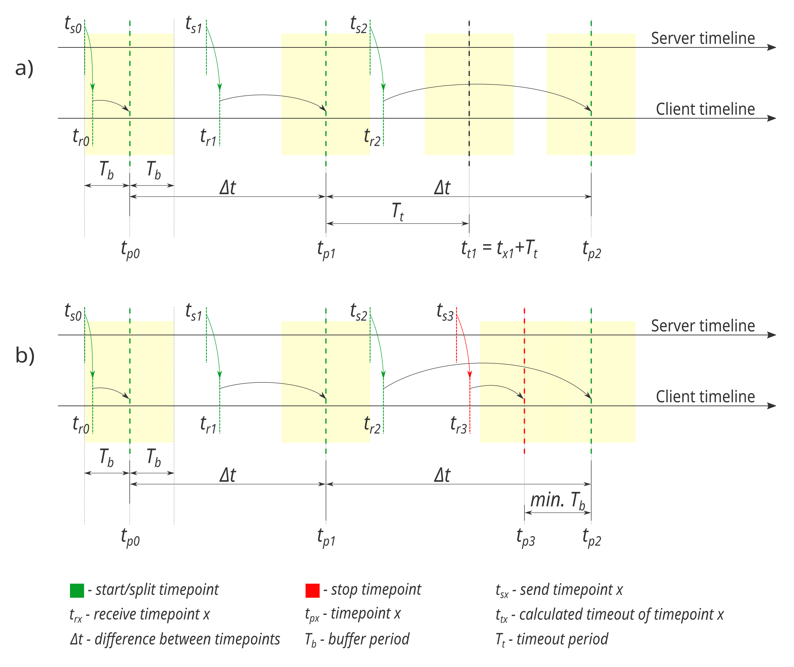

@page kespp KESP-P
@tableofcontents

# Protokół komunikacji systemu kolektor-pluginy w KMD3, pracującego na edge'u - ``KESP-Pv1`` (*KMD3 Edge Synchronization Protocol for Plugins version 1*)
&nbsp;  


## 1. Specyfikacja mechanizmów komunikacji międzyprocesowej (IPC):
- do komunikacji międzyprocesowej służy protokół `TCP` w domenie `AF_INET` lub `AF_LOCAL` (do wyboru w konkretnej implementacji),
- jeśli protokół używany jest w domenie `AF_INET`, domyślny port to `19251`,
- dane poszczególnych typów transmitowane są binarnie, według zdefiniowanych poniżej rodzajów ramek,
- przyjmuje się kolejność bajtów typu `little-endian`,
- wielkość wszystkich rodzajów ramek jest nieduża (<<1 kB), więc nie jest uwzględniany podział ramek na wiele pakietów,
- ponieważ zawsze oczekiwana jest ramka o znanym rozmiarze, pakiety można rozróżniać na podstawie ilości dostarczonych danych.
&nbsp;  
&nbsp;  
&nbsp;  


## 2. Definicje i ogólny opis pracy systemu zarządzającego synchronizowanym rejestrowaniem danych
&nbsp;  

### 2.1. **Serwer (kolektor)** to oprogramowanie, które względem klientów zarządza:
- informacjami o kontekście pracy pluginu,
- czasem rozpoczęcia rejestracji danych,
- czasem podziału strumienia danych na porcje,
- czasem kończenia rejestracji danych.
&nbsp;  
&nbsp;  


### 2.2. **Klient (plugin kolektora)** to oprogramowanie zajmujące się rejestrowaniem danych pochodzących z pojedynczego sensora, czyli tworzeniem pliku z danymi

Pojedyncza sesja nagrywania danych nie oznacza, że plugin zapisze tylko jeden plik z danymi. Plugin zapisuje pojedynczą sesję rejestracji danych (strumień) w postaci wielu plików - ***porcji***. Podział na porcje powoduje powstawanie mniejszych plików, ułatwia ich przesył do chmury i dalsze manipulowanie nimi. Aby zachować synchronizację między zarejestrowanymi porcjami, czas rozpoczęcia rejestracji, czas podziału, w którym plugin powinien rozpocząć rejestrację do nowego pliku i czas zakończenia rejestracji są wspólne dla wszystkich pluginów i są narzucane przez kolektor.

Aby plugin mógł zapisać dane w odpowiednich porcjach, czasy rozpoczęcia, podziału i zakończenia dostarczane są z wyprzedzeniem. Raz dostarczony czas podziału obowiązuje aż do jego minięcia. Jedynie dostarczenie informacji o czasie zakończenia rejestracji ma wyższy priorytet od czasu podziału.

Każdy klient **powinien** pracować na tej samej maszynie, na której pracuje kolektor - jest to wymagane do synchronizacji i wspólnego "rozumienia" czasu.
&nbsp;  
&nbsp;  


### 2.3. ***Buffer Period (T<sub>b</sub>)*** - okres buforowy
Zdefiniowany w konfiguracji serwera okres (domyślnie *100 ms*) poprzedzający każdy punkt czasowy oraz następujący po każdym punkcie czasowym. Suma okresu poprzedzającego i następującego po konkretnym punkcie to *okres krytyczny* tego punktu (trwający 2·T<sub>b</sub>). Jako punkt czasowy uznaje się punkt podziału, punkt timeout oraz punkt stopu.

Podczas trwania okresu krytycznego wysyłanie ramek jest zabronione, a więc ramka wskazująca pewien punkt czasowy musi być wysłana z odpowiednim wyprzedzeniem, tak aby jej wysyłanie nie wystąpiło w okresie krytycznym punktu, który sama określa (lub w okresie krytycznym innego punktu).

Nie można też ustawiać punktów czasowych w takich odległościach aby ich okresy krytyczne nakładały się. Wyjątkiem jest punkt stopu występujący tuż przed punktem podziału - między tymi punktami minimalna odległość to tylko jeden okres buforowy (T<sub>b</sub>). 

Zachowanie okresów krytycznych leży wyłącznie po stronie serwera. Klient nie kontroluje ani nie zna długości okresu buforowego - sprawdza czy nie dotarły nowe informacje (np. ramka zatrzymująca rejestrację) aż do osiągnięcia danego punktu czasowego. Ważne jest więc ustawienie tak długiego okresu buforowego aby każdy z klientów zdążył odebrać i zinterpretować nowe dane.
&nbsp;  
&nbsp;  
&nbsp;  


## 3. Sekwencja komunikacji kolektora i pluginów
1. Kolektor (serwer) jest uruchamiany i oczekuje na połączenia klientów.
10. Klient łączy się do serwera (inicjuje również swój sensor, tak aby być gotowym do natychmiastowego uruchomienia rejestracji danych).
20. Klient wysyła ramkę informującą o rodzaju protokołu/typie klienta (ramka [PROTOCOL](#41-ramka-protocol)).
30. Serwer wysyła *ramkę powitalną* (ramka [WELCOME_01](#42-ramka-welcome_01)), według której klient weryfikuje numer wersji używanego protokołu. Jeśli wersje różnią się, klient zamyka połączenie bądź dostosowuje się do używanej wersji.
40. Serwer oczekuje na połączenia kolejnych klientów.
50. Kiedy serwer otrzyma komendę do rozpoczęcia rejestracji (np. na żądanie użytkownika), do wszystkich klientów rozsyła *ramkę sterującą* (ramka [CONTROL_01](#43-ramka-control_01)), która informuje o planowanym czasie rozpoczęcia rejestracji. Różnica między czasem rozpoczęcia rejestracji, a momentem rozsyłania ramki nie może być mniejsza niż, zdefiniowany wcześniej, okres buforowy.
60. Po minięciu przynajmniej okresu buforowego od momentu uruchomienia nagrywania, serwer może rozesłać kolejną *ramkę sterującą* (ramka [CONTROL_01](#43-ramka-control_01)), wskazującą punkt czasowy, w którym należy podzielić nagranie. *Ramka sterująca* podziałem powinna zostać wysłana na **co najmniej** jeden okres buforowy przed planowanym czasem podziału (który sama definiuje). Ramka ta nie może być powtórzona. Nie można wysłać ramki z innym czasem podziału, zanim nie minie dotychczasowy punkt podziału. Nie można również wysłać ramki informującej o czasie podziału na mniej niż jeden okres buforowy przed punktem timeout'u. Ramka informująca o rozpoczęciu rejestracji, nie różni się od ramki informującej o podziale nagrania.
70. Kolejne ramki, informujące o kolejnych czasach podziałów wysyłane są zawsze w ramach czasowych określonych powyżej - **co najmniej** jeden okres buforowy po poprzednim czasie podziału i **co najmniej** jeden okres buforowy przed kolejnym czasem podziału.
80. Jeśli klient nie otrzyma kolejnej *ramki sterującej* co najmniej jeden okres buforowy przed obliczonym punktem czasowym timeout'u (ostatni znany `chunk_nanosec + timeout_nanosec`), kończy rejestrację danych w tym punkcie czasowym i zamyka połączenie (jeśli wciąż jest otwarte). *Jeśli serwer przestanie działać, mechanizm timeout'u gwarantuje zakończenie rejestracji danych przez wszystkie pluginy w tym samym, z góry określonym momencie czasowym - klienci nie kończą rejestracji nawet w momencie zerwania połączenia z serwerem.*
90. Serwer wciąż oczekuje na połączenia nowych klientów, które mają szansę na rozpoczęcie rejestracji w momencie podziału. Taki klient od razu po *ramce powitalnej* otrzymuje *ramkę sterującą*, określającą moment podziału, w którym klient może uruchomić nagrywanie (dla klienta jest to po prostu ramka rozpoczynająca). Jeśli klient nie zdąży uruchomić rejestracji precyzyjnie w momencie podziału, powinien wyrównać początek porcji pustymi próbkami lub zaczekać do następnego momentu podziału.
100. Kiedy serwer otrzyma komendę do zatrzymania rejestracji (np. na żądanie użytkownika), wysyła *ramkę sterującą* (ramka [CONTROL_01](#43-ramka-control_01)) informującą o planowanym zatrzymaniu rejestracji danych. Ramka ta powinna zostać wysłana z wyprzedzeniem **co najmniej** jednego okresu buforowego przed planowanym czasem zatrzymania, ale czas ten nie może wypadać w okresie krytycznym podziału (jeśli tak się stanie, punkt zatrzymania musi być przesunięty za punkt podziału). Ramka ta, tak jak pozostałe, również nie może być wysłana w okresie krytycznym.
110. Kiedy minie planowany czas zatrzymania rejestracji klienci zamykają pliki i oczekują na dalsze komendy - rozpoczęcie rejestracji lub zamknięcie połączenia.
120. Kolektor może wysłać ramkę planującą rozpoczęcie rejestracji według zasad opisanych powyżej.
130. Kolektor może również zamknąć połączenie z każdym z klientów.

{html: width=70%}
&nbsp;  
&nbsp;  
&nbsp;  


## 4. Definicje ramek
Przyrostek wersji ramki zdefiniowany za nazwą ramki odpowiada wersji protokołu.
&nbsp;  
&nbsp;  


### 4.1. Ramka `PROTOCOL`
Kierunek klient->serwer, wielkość: `1 B`

Ramka nie może zostać zmieniona w żadnej wersji protokołu. Kolektor, w ramach jednego portu sieciowego może uruchomić różne rodzaje protokołów. Najpierw należy więc określić rodzaj protokołu (`KESP-P`). Dopiero po określeniu, który protokół będzie używany (jaki jest typ klienta łączącego się do kolektora), znaczenie ma wersja protokołu, którą określa serwer.
```c++
struct ProtocolFrame
{
    uint8_t protocol = 1;  //always value 1 (for KESP-P)
};
```

#### Znaczenie pól:
- `protocol` - typ klienta/protokół - dla `KESP-P` zawsze wartość 1
&nbsp;  
&nbsp;  


### 4.2. Ramka `WELCOME_01`
Kierunek serwer->klient, wielkość: `17 B`
```c++
struct Welcome01Frame
{
    uint8_t protocol_version = 1;  //for KESP-Pv1, 2 for KESP-Pv2, N for KESP-PvN
    uint64_t realtime_diff_nanosec = CLOCK_REALTIME_ns - CLOCK_MONOTONIC_ns;
    uint64_t timeout_nanosec;
};
```

#### Znaczenie pól:
- `protocol_version` - wersja protokołu, zbieżna z numeracją dokumentu i numeracją nazw ramek. Klient powinien sprawdzić czy wersja protokołu, której używa jest zgodna z numerem wersji otrzymanym od serwera - jeśli nie, jest zobowiązany zamknąć połączenie;
- `realtime_diff_nanosec` - ilość nanosekund jaką trzeba dodać do `chunk_nanosec` (z *ramki sterującej*), aby uzyskać czas z jakim zapisać plik (ilość nanosekund, która minęła od epoki); Aby zmniejszyć rozdzielczość uzyskanego czasu, należy wykonać dzielenie całkowite (uciąć mniej znaczące cyfry);
- `timeout_nanosec` - ilość nanosekund jaką należy dodać do ostatniego znanego punktu podziału aby uzyskać punkt timeout'u
&nbsp;  
&nbsp;  


### 4.3. Ramka `CONTROL_01`
Kierunek serwer->klient, wielkość: `9 B`
```c++
struct Control01Frame
{
    int64_t chunk_nanosec;
    uint8_t stop_flag;  // as bool
};
```

#### Znaczenie pól:
- `chunk_nanosec` - zaplanowany czas podziału [nanosekundy] według używanego zegara monotonicznego;
- `stop_flag` - jeśli flaga jest ustawiona (wartość 0 = false; wartość 1 = true, czyli flaga ustawiona), jest to ramka planująca zakończenie rejestracji danych.
&nbsp;  
&nbsp;  
&nbsp;  


## 5. Pułapki implementacji systemu oraz zalecane mechanizmy jego pracy
- Może dojść do sytuacji, w której np. podczas pobrania z sensora buforu z danymi część danych powinna trafić jeszcze do poprzedniej porcji, a część do nowej. Taką sytuację programista pluginu powinien uwzględnić w swojej implementacji.

- Jeśli znane są interwały między próbkami sensora również należy ich pilnować. Może się zdarzyć, że dryf zegara sensora względem zegara maszyny, na której pracuje kolektor, spowoduje wyprodukowanie zbyt małej lub zbyt dużej ilości próbek. Należy często wyrównywać nadmiarowe lub brakujące próbki np. poprzez powtórzenie próbki w przypadku zbyt małej ich ilości (lub wstawienie pustej - zależy od specyfiki danych) lub odrzucenie jednej z (lub więcej) próbek w przypadku zbyt dużej ich ilości.

- Jeśli jakiś sensor będzie mógł pracować samodzielnie, można uwzględnić tryb, w którym nadmiarowe lub brakujące próbki nie są wyrównywane (nie są powtarzane lub gubione).

- Przekazany punkt czasowy mówi zawsze o początku nowej porcji, a nie o ostatnim momencie poprzedniej porcji. Np. jeśli czas podziału przypada na 10. sekundę, to próbka z czasu 9.999 s należy do poprzedniej porcji, a próbka z czasu 10.000 s należy już do nowej porcji.

- Czas rzeczywisty zapisywany przez pluginy w nazwie pliku powinien bazować na sumie dwóch wartości: czas podziału (`chunk_nanosec` przekazany w *ramce sterującej*) i różnica czasu (`realtime_diff_nanosec` przekazana w *ramce powitalnej*). *Ze względu na niestabilność zegara systemowego, czas który zapisywany jest w nazwie pliku nie powinien być konwertowany z przekazanego punktu czasowego - pluginy mogłyby wyprodukować różne czasy w nazwach, ponieważ mogłyby wykonywać konwersję w różnych momentach, pomiędzy którymi czas systemowy został przestawiony.*
Więcej informacji o konwersji czasu do nazwy znajduje się w definicji *ramki powitalnej*.

- Ważne jest aby implementacje kolektora i pluginów korzystały z tego samego zegara (*system-wide*) monotonicznego. Zalecanym zegarem jest `CLOCK_MONOTONIC` (na Linuksie zapewnia zgodność również z pythonowym `time.monotonic_ns()` - [więcej o zgodności z pythonem](https://www.python.org/dev/peps/pep-0418/#time-monotonic). *Zegary `CLOCK_MONOTONIC_RAW` i `CLOCK_MONOTONIC_COARSE` są niezalecane - brak dostępności poza Linuksem i niższa rozdzielczość drugiego. Nie można korzystać z implementacji zegarów monotonicznych, które mogą wskazywać różne wartości w różnych procesach. Należy pamiętać również o łatwym dostępie wybranego zegara w innych systemach i językach programowania.* Więcej informacji o pomiarze czasu, rodzajach zegarów sprzętowych i rozdzielczości zegarów: https://www.python.org/dev/peps/pep-0418/#hardware-clocks.

- Protokół nie przewiduje uśpienia systemu podczas trwania sesji rejestracyjnej, a więc system nie może zostać uśpiony w trakcie sesji.

- Warto zadbać o ustawienie odpowiedniego czasu systemowego przed rozpoczęciem sesji rejestracyjnej, a nawet przed uruchomieniem kolektora.

- Korzystnie na działanie protokołu może wpływać wyłączenie algorytmu Nagle'a (w `setsockopt` opcja `TCP_NODELAY`).

- Implementacja przestrzegania okresów buforowych w serwerze powinna uwzględniać sytuację wywłaszczenia wątków serwera w dowolnym momencie - jeśli punkt czasowy będzie uwzględniał okres buforowy jedynie w momencie konstruowania ramki, to wywłaszczenie wątku spowoduje znaczne opóźnienie w wysłaniu ramki, a tym samym niedotrzymanie okresu buforowego. Punkty czasowe najlepiej jest zatem tworzyć z wyprzedzeniem większym niż długość okresu buforowego.
&nbsp;  
&nbsp;  
&nbsp;  
